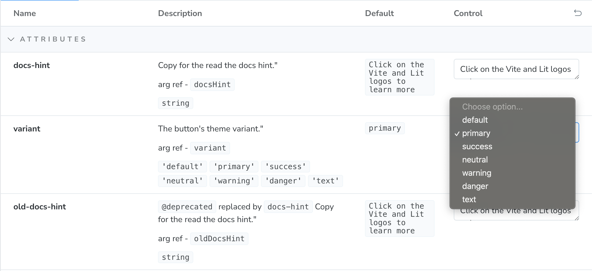
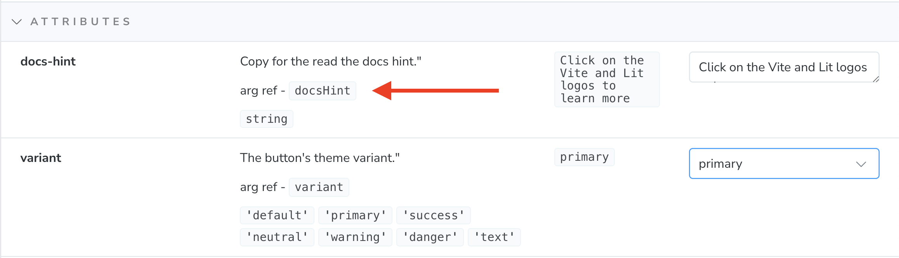
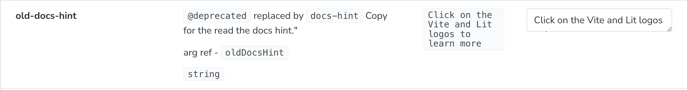
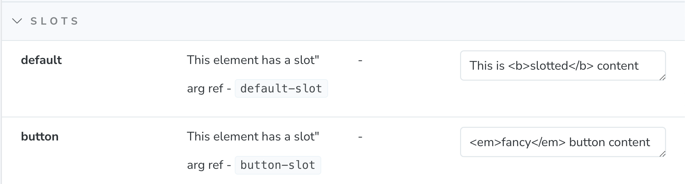
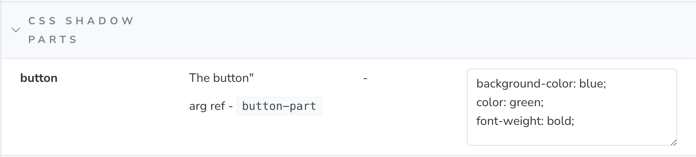

import { Aside } from '@astrojs/starlight/components';

These helpers are designed to make integrating Web Components with Storybook easier.

There are a number of things that this helper library does to provide developers a better experience with Storybook and Web Components:

1. Uses types to provide better controls
2. Prevents name collisions when attributes, properties, slots, and CSS shadow parts share the same name
3. Provides a template with bindings for attributes, properties, CSS custom properties, and CSS shadow parts.
4. Provides two-way binding for controls and attributes in the template to help keep control values in sync with the component

<div class="center">
  <a href="https://stackblitz.com/edit/github-fkmbdscn?file=README.md">
    
  </a>
</div>

## Before You Install

1. If you don't already have it installed, follow the installation steps in the [Storybook docs](https://storybook.js.org/docs/web-components/get-started/install) for web components

```bash
npm create storybook@latest
```

2. Load your custom elements manifest into Storybook in the `.storybook/preview.js` file:

```js
// .storybook/preview.js
import { setCustomElementsManifest } from "@storybook/web-components";
import manifest from "./path/to/custom-elements.json" with { type: "json" };

setCustomElementsManifest(manifest);
```

3. Add the expanded controls to your config in the `.storybook/preview.js` file:

```js
export const parameters = {
  ...
  controls: {
    expanded: true,
    ...
  },
}
```

## Installation

Now that you have Storybook installed, you can install the helpers:

```bash
npm i -D @wc-toolkit/storybook-helpers
```

Next, if you have [global configurations](#global-configurations), set those in your Storybook config in the `.storybook/preview.js` file:

```ts
// preview.js
import { setStorybookHelpersConfig, type Options } from "@wc-toolbox/storybook-helpers";

const options: Options = {...}

setStorybookHelpersConfig(options);
```

## Setup

Import the storybook helpers into your story and get the appropriate helpers by passing your element's tag name into the Storybook helper function. 
the function will return the helper data you can assign to the Storybook `meta` object.

```ts
// my-element.stories.ts
import type { Meta, StoryObj } from "@storybook/web-components";
import { getStorybookHelpers } from "@wc-toolkit/storybook-helpers";

const { events, args, argTypes, template } = getStorybookHelpers("my-element");

const meta: Meta<MyElement> = {
  title: "Components/My Element",
  component: "my-element",
  args,
  argTypes,
  render: (args) => template(args)
  parameters: {
    actions: {
      handles: events,
    },
  },
};
export default meta;
```

The function returns the following:
- `events`: an array of events that will be captured in the actions tab
- `args`: this provides the default values for the component `args`
- `argTypes`: an object tha configures the controls for the component based on the data from the Custom Elements Manifest
- `template`: a function that will return a template for the component as well as provide two-way data binding for the component's API and the Storybook controls

### Using the `template` Helper

The `template` helper is completely optional, but provides a great deal of functionality including API mapping of args and two-way data binding for controls.

To add the template to your story, use and arrow function to pass the story's `args` (these are the values defined in the story's `args` API and the values from the controls) to the `template` function (this is an optional parameter, but required for arguments to function properly):

You can add this globally in the story's `meta` object and to the `render` property of the individual story's object.

```ts
// my-element.stories.ts

/**
 * create Story type that will provide autocomplete and docs for `args`,
 * but also allow for namespaced args like CSS Shadow Parts and Slots
 */
type Story = StoryObj<MyElement & typeof args>;

export const Default: Story = {
  render: (args) => template(args),
  args: {},
};
```

### `argTypes`

Based on the data in the custom elements manifest, the helpers will apply appropriate descriptions and control types to your arguments.

#### Control Types

The default control types are not always the most helpful. The helper will use your types try to identify the appropriate input and options for your control.

For example if your component has an attribute called `variant` with predefined values, the helper will convert it to a select that is pre-populated with the appropriate values and the default value selected.



#### Name-Spaced Controls

One of the challenges with the default implementation is that if there are multiple properties with the same name, they will be overridden. For example, if there is an attribute named `label` as well as a slot named `label` only one will display. In order to ensure every argument is displayed properly, CSS Shadow Part and Slot arguments will be suffixed with `-part`, and `-slot` respectively. CSS Custom Properties don't receive one because they already have a unique property value and attributes and properties will rely on the camel-cased property name.

The reference name will be documented with the control's description.



That reference can then be used to bind default values to the template.

```ts
// my-element.stories.ts
export const Default: Story = {
  render: (args) => template(args),
  args: {
    docsHint: "Some other value than the default",
  },
};
```

#### Deprecated Controls

If you use the `@deprecated` tag in your jsDoc descriptions, those will also display in the description.

```ts
// my-element.ts
/**
 * @deprecated replaced by `docs-hint`
 * Copy for the read the docs hint.
 */
@property({ attribute: "old-docs-hint", reflect: true })
oldDocsHint = "Click on the Vite and Lit logos to learn more";
```



### Overriding Controls

If you would like to change any of your controls, you can easily override it using the spread operator and passing in an updated `argType` after the helper `argTypes`.

```js
// my-element.stories.ts
export default {
  title: "Components/My Element",
  component: "my-element",
  argTypes: {
    ...argTypes,
    docsHintAttr: {
      name: 'docs-hint',
      description: '...',
      defaultValue: '...',
      control: {
        type: '...',
      },
      table: {
        category: 'attributes',
        defaultValue: {
          summary: '...',
        },
        type: {
          summary: '`string`',
        },
      },
  },
  ...
};
```

## Events

If you want to capture the events output by your component, you can map them to your story's config under the parameter's section.

**Note:** They will only be captured if the `bubbles` option on your `CustomEvent` is set to `true` (note - it is `true` by default).

```js
// my-element.stories.ts
export default {
  ...
  parameters: {
    actions: {
      handles: events,
    },
  },
};
```

If you would like to map additional events to your story, you can use the spread operator to extend the values.

```js
// my-element.stories.ts
export default {
  ...
  parameters: {
    actions: {
      handles: [...events, 'my-other-event'],
    },
  },
};
```

### Events in Actions Tab

If you are not seeing the events show up in your actions tab, it may be one of two things:

1. Your events are not [configured to bubble](https://javascript.info/dispatch-events#bubbling-example).
2. Your Storybook configuration needs to be updated to include the `withActions` decorator.

```ts
// preview.js
import { withActions } from '@storybook/addon-actions/decorator';

const preview: Preview = {
  parameters: {
    controls: {
      expanded: true,
      sort: 'alpha'
    },
  },
  decorators: [withActions],
};
```

## Templates

Templates are configured to automatically map the control's attributes, properties, CSS custom properties, and CSS shadow parts to your element as well as provide two-way data binding for the component attributes back to the controls to keep them in sync.

Templates take 2 arguments - story arguments and slot data. You can use the controls and story `args` to provide slot data, but if you want more granular control, using the `slot` parameter on the template with more editor support.

```ts
// my-element.stories.ts
export const SlottedContent: Story = {
  render: (args) => template(
    args,
    html`
      <span slot="label">My Select</span>
      <my-option>Option 1</my-option>
      <my-option>Option 2</my-option>
      <my-option>Option 3</my-option>
    `
  ),
  args: {
    docsHint: "Some other value than the default",
  },
};
```

### Extending Templates

Component templates can be interpolated into a story's template with additional content.

```ts
// my-element.stories.ts
export const WithParentFormElement: Story = {
  render: (args) => html`
  <form>
    ${template(
      args,
      html`
        <span slot="label">My Select</span>
        <my-option>Option 1</my-option>
        <my-option>Option 2</my-option>
        <my-option>Option 3</my-option>
      `
    )}
    <button>Submit</button>
  </form>
`,
  args: {
    docsHint: "Some other value than the default",
  },
};
```

If you have enabled the [`setComponentVariable`](#add-component-variable) option, the template also exposes a variable named `component` that references the custom element so you can use custom logic with it.

```ts
// my-element.stories.ts
export const WithSomeCustomLogic: Story = {
  render: (args) => html`
    ${template(
      args,
      html`
        <span slot="label">My Select</span>
        <my-option value="1">Option 1</my-option>
        <my-option value="2">Option 2</my-option>
        <my-option value="3">Option 3</my-option>
      `
    )}
    <script>
      // set property values
      component.value = "2";

      // call component methods
      component.show();
    </script>
  `,
  args: {
    docsHint: "Some other value than the default",
  },
}
```

### Using Slot Controls

If you are using the `template`, using slots form the controls panel is fairly straight forward. The input is already wired up to the appropriate slot and so rich content can be added directly to the input with no additional set-up required.



### Using CSS Shadow Parts and States Controls

Like the slot controls, the `template` makes working with CSS Shadow Parts and custom CSS States easy. 
The template is pre-configured with the appropriate code for styling to the component's parts and states. 
You can simply apply the styles directly to the control input.



## Global Configuration

The helpers package provides a way to set global configurations for your stories using the `setStorybookHelpersConfig` function. This can be added to the `.storybook/preview.js` file.

```ts
//preview.js
import { setStorybookHelpersConfig, type Options } from "@wc-toolbox/storybook-helpers";

const options: Options = {...}

setStorybookHelpersConfig(options);
```

The helpers can be passed the following options:

```ts
type Options = {
  /** hides the `arg ref` label on each control */
  hideArgRef?: boolean;
  /** sets the custom type reference in the Custom Elements Manifest */
  typeRef?: string;
  /** Adds a <script> tag where a `component` variable will reference the story's component */
  setComponentVariable?: boolean;
  /** renders default values for attributes and CSS properties */
  renderDefaultValues?: boolean;
  /** Category order */
  categoryOrder?: Array<Categories>;
};

type Categories =
  | "attributes"
  | "cssParts"
  | "cssProps"
  | "cssStates"
  | "events"
  | "methods"
  | "properties"
  | "slots";
```

### Hide "Arg Refs"

There may be times you want to hide the "arg ref" label. You can set the `hideArgRef` to `true` and it will remove the label from controls.

```ts
setStorybookHelpersConfig({ hideArgRef: true });
```

### Custom Types using `typeRef`

It is common for teams to parse or create custom types and add them to the Custom Elements Manifest to use for other tools (if you're not already, [Type Parser plugin](/documentation/type-parser)) can help with this. 
The helpers can be configured to use those types instead of the default types in your manifest using the `typeRef`. 
If no custom type is found, it will fallback to the default type.

```ts
setStorybookHelpersConfig({ typeRef: "parsedType" });
```

### Set Component Variable

Every story using the `template` helper includes the option to add a script tag with a reference to the custom element in the `component` variable. The `setComponentVariable` option adds this script tag and the variable.

```ts
setStorybookHelpersConfig({ setComponentVariable: true });
```

### Render Default Attribute Values

If an `arg` value matches the default value, it will not be added to the component. To always show the default values for attributes and CSS custom properties, enable the `renderDefaultValues` setting:

```ts
setStorybookHelpersConfig({ renderDefaultValues: true });
```

### Category Order
The order of the component's API categories in the controls panel can be configured using the `categoryOrder` option. 
The order is defined by the array of category names.

<Aside>If a category is not included in the array, that section will not be included in the controls.</Aside>

```ts
setStorybookHelpersConfig({ categoryOrder: ["cssProps", "cssStates", "attributes"] });
```

## Story Configuration

The `getStorybookHelpers` function can be passed an options object to configure the helpers on a per-story basis.

```ts
// my-element.stories.ts
import { getStorybookHelpers, type StoryOptions } from "@wc-toolkit/storybook-helpers";

const options: StoryOptions = {...};
const { events, args, argTypes, template } = getStorybookHelpers("my-element", options);
```

```ts
type StoryOptions = {
  /** Categories to exclude from these stories */
  excludeCategories?: Array<Categories>;
};
```

### Exclude Categories

If you would like to exclude certain categories from your story, you can pass an array of categories to the `excludeCategories` option.

```ts
// my-element.stories.ts
const { events, args, argTypes, template } = getStorybookHelpers("my-element", {
  excludeCategories: ["cssProps", "cssStates"],
});
```
