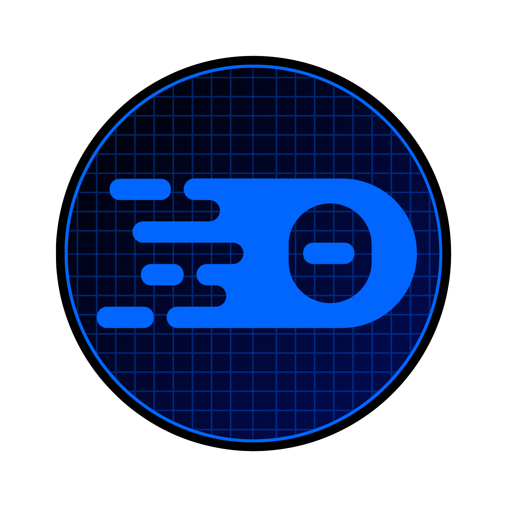

import { Aside } from '@astrojs/starlight/components';

<Aside>This is currently in `alpha` and is experimental.</Aside>


It provides intelligent language support for building with Web Components. 
This extension enhances your development experience with advanced IntelliSense and validation for Web Components.

The initial version is available for VS Code based editors, but more editor support is planned. 

<div class="editor-icons">

- [](https://marketplace.visualstudio.com/items?itemName=wc-toolkit.web-components-language-server)
- [](https://open-vsx.org/extension/wc-toolkit/web-components-language-server)
- [](https://open-vsx.org/extension/wc-toolkit/web-components-language-server)
- [](https://open-vsx.org/extension/wc-toolkit/web-components-language-server)
- [](https://open-vsx.org/extension/wc-toolkit/web-components-language-server)

</div>

## Installation

### From VS Code Marketplace

1. Open Visual Studio Code
2. Go to Extensions (`Ctrl+Shift+X` / `Cmd+Shift+X`)
3. Search for "Web Components Language Server"
4. Click "Install"

### Manual Installation

1. Download the `.vsix` file from the releases page
2. Open VS Code
3. Run `Extensions: Install from VSIX...` from the Command Palette
4. Select the downloaded file

## Usage

### IntelliSense in Action

```html
<!-- Get intelligent suggestions for custom elements -->
<my-custom-element my-attribute="value"></my-custom-element>
```

### Disabling diagnostics with comments

You can locally disable `wctools` diagnostics using HTML comment directives. These mirror ESLint-style disables and support stacking multiple rule names (comma or space separated).

- Disable rules for the entire file:

```html
<!-- wctools-ignore -->
<!-- wctools-ignore unknownAttribute deprecatedAttribute -->
```

- Disable diagnostics for the following line:

```html
<!-- wctools-ignore-next-line deprecatedAttribute -->
<my-element deprecated-attr></my-element>
```

Rules can be listed separated by spaces or commas (whitespace around commas is ignored), e.g.:
`<!-- wctools-ignore ruleA ruleB,ruleC -->`.

### Supported File Types

This plugin currently works with any file type, but additional configurations will be added to customize this experience in the future.

## AI Integration


The Web Components Language Server provides built-in AI integration to help you work with Web Components more efficiently.

### VS Code Chat Participant

If you're using VS Code (version 1.90+), you can use the `@wctools` chat participant to get information about your Web Components directly in the native chat interface.

**Example queries:**

- `@wctools what properties does my-button have?`
- `@wctools compare my-button and my-link`
- `@wctools list all components`
- `@wctools search for form components`

### Language Model Tool (Cursor/Copilot)

For editors like Cursor that support Language Model Tools, the extension registers the `wctools-docs` tool that AI assistants can use automatically to retrieve component documentation.

**The AI can:**
- Look up component properties, methods, and events
- Get type information for attributes
- Access component descriptions and usage examples
- Query all components at once

**Example conversation with Cursor:**
```
You: "How do I use the my-button component?"
Cursor AI: *automatically uses wctools-docs tool* "The my-button component has..."
```

### Model Context Protocol (MCP) Server

The extension includes an optional MCP server that exposes your Web Component documentation to external AI tools like Claude Desktop.

#### Enabling the MCP Server

By default, the MCP server is disabled. To enable it:

1. Open VS Code Settings (`Ctrl/Cmd + ,`)
2. Search for "wctools mcp"
3. Enable "Wctools: MCP Enabled"
4. Configure optional settings:
   - **Transport**: `http` (default) or `stdio`
   - **Port**: `3000` (default)
   - **Host**: `localhost` (default)

Or add to your `settings.json`:

```json
{
  "wctools.mcp.enabled": true,
  "wctools.mcp.transport": "http",
  "wctools.mcp.port": 3000,
  "wctools.mcp.host": "localhost"
}
```

#### Using with other editor

To connect Claude Desktop to the MCP server:

1. Follow your editors guidelines for connecting to an MCP server
2. The following is the wctools server configuration:

```json
{
  "mcpServers": {
    "wctools": {
      "url": "http://localhost:3000/sse"
    }
  }
}
```

1. Restart your editor

**Now your editor can access your component documentation!**

```
You: "What properties does my-button have?"
Editor: *uses wctools MCP server* "Based on your project's components..."
```

#### MCP Server Endpoints

When running in HTTP mode, the server exposes:

- `http://localhost:3000/health` - Health check endpoint
- `http://localhost:3000/sse` - Server-Sent Events endpoint for MCP clients
- `http://localhost:3000/message` - Message handling endpoint

#### Checking MCP Server Status

Run the command `Web Components: Check MCP Server Status` from the Command Palette to verify:
- Whether the MCP server is enabled
- Current configuration (transport, port, host)
- Number of components loaded
- Server health status

## Configuration

To configure the Web Components Language serve create a file named `wc.config.js` at the root of your workspace and export the configuration object.

```js
// wc.config.js
export default {
  // your config options here
};
```

### Available Settings

```ts
/** Configuration options for the Web Components Language Server. */
interface WCConfig extends LibraryConfig {
  /**
   * Specifies a list of glob patterns that match files to be included in compilation.
   * If no 'files' or 'include' property is present in a tsconfig.json, the compiler defaults to including all files in the containing directory and subdirectories except those specified by 'exclude'.
   */
  include?: string[];

  /** Specifies a list of files to be excluded from compilation. The 'exclude' property only affects the files included via the 'include'. */
  exclude?: string[];

  /** Used to enable debugging output. */
  debug?: boolean;

  /** Library specific configuration. */
  libraries?: {
    /** Configuration for each library by name where the key is package name */
    [libraryName: string]: LibraryConfig;
  };
}

/** Options for configuring the Language Server for a library */
export interface LibraryConfig {
  /**
   * Specify a custom path to the CustomElements Manifest
   * The path can be for a local file or a remote URL.
   */
  manifestSrc?: string;

  /** Optional function to format tag names before processing. */
  tagFormatter?: (tagName: string) => string;

  /**
   * Alternative property name that types may be mapped to
   * @default "parsedType"
   */
  typeSrc?: string;

  /** Diagnostic severity levels for various validation checks. */
  diagnosticSeverity?: {
    /**
     * Severity for invalid boolean attribute values.
     * @default "error"
     */
    invalidBoolean?: DiagnosticSeverity;
    /**
     * Severity for invalid number attribute values.
     * @default "error"
     */
    invalidNumber?: DiagnosticSeverity;
    /**
     * Severity for invalid attribute values.
     * @default "error"
     */
    invalidAttributeValue?: DiagnosticSeverity;
    /**
     * Severity for usage of deprecated attributes.
     * @default "warning"
     */
    deprecatedAttribute?: DiagnosticSeverity;
    /**
     * Severity for usage of deprecated elements.
     * @default "warning"
     */
    deprecatedElement?: DiagnosticSeverity;
    /**
     * Severity for usage of duplicate attributes.
     * @default "error"
     */
    duplicateAttribute?: DiagnosticSeverity;
    /**
     * Severity for usage of unknown elements.
     * @default "warning"
     */
    unknownElement?: DiagnosticSeverity;
    /**
     * Severity for usage of unknown attributes.
     * @default "info"
     */
    unknownAttribute?: DiagnosticSeverity;
  };
}

type DiagnosticSeverity = "error" | "warning" | "info" | "hint" | "off";
```

#### Example Configuration

```js
// wc.config.js
export default {
  /** Fetch manifest from a local directory */
  manifestSrc: './build/custom-elements.json',

  /**
   * Only enable the Language Server feature for the TypeScript
   * and HTML files in the `src` directory of the project.
   */
  include: ['src/**/*.ts', 'src/**/*.html'],

  /**
   * Add the custom suffix `_global` for all components.
   * Language server options will now work for `my-button_global`.
   */
  tagFormatter: (tagName) => `${tagName}_global`,

  diagnosticSeverity: {
    /**
     * Show duplicate attributes only as a warning instead of an error (global default override).
     */
    duplicateAttribute: 'warning'
  },

  /** Library specific configurations (override root settings for that library only). */
  libraries: {
    "@awesome.me/webawesome": {
      /**
       * Fetch manifest from a URL.
       * (Optional if the NPM package is installed and exposes custom-elements.json)
       */
      manifestSrc: 'https://cdn.jsdelivr.net/npm/@awesome.me/webawesome@3.0.0-beta.4/dist/custom-elements.json',

      /**
       * Replace `wa-` prefix with `awesome-` for all Web Awesome components.
       * Language server options will now work for `awesome-button` instead of `wa-button`.
       */
      tagFormatter: (tagName) => tagName.replace('wa-', 'awesome-'),

      diagnosticSeverity: {
        /** Treat duplicate attributes as warnings just for this library (overrides global). */
        duplicateAttribute: 'warning'
      }
    }
  }
};
```

## Troubleshooting

### Common Issues

**Extension not working?**

- Ensure you have a supported file open
- Check that the extension is enabled in settings
- Restart VS Code if needed

**IntelliSense not appearing?**

- Make sure you are using the latest version.
- If your Custom Elements Manifest is not at the root of your project or is remote, use the `wc.config.js` to point the language server to the right direction.
- Try restarting the language server (`Ctrl/Cmd+Shift+P` > `Web Components: Restart Language Server`)
- Check the output panel for errors (`View` > `Output`, then select `Web Components Language Server` from the dropdown)

---

**Enjoy enhanced Web Components development!** 🎉
