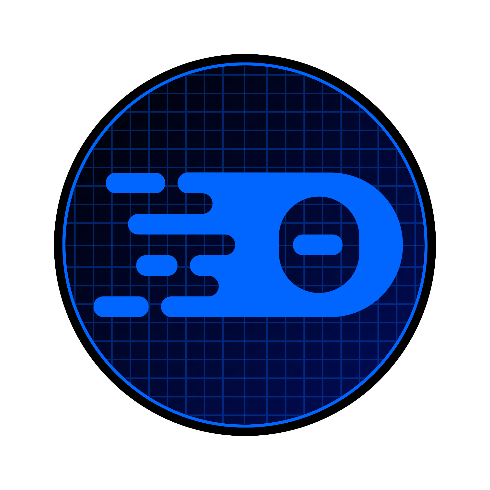
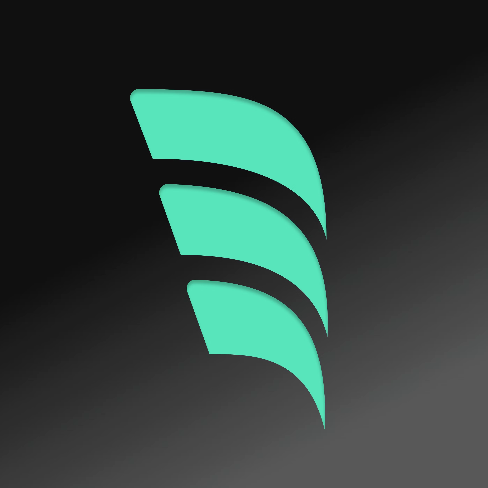
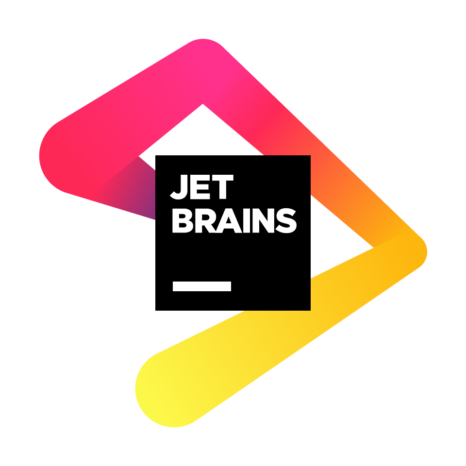

import { Aside } from '@astrojs/starlight/components';

<Aside>This is currently in `alpha` and is experimental.</Aside>

It provides intelligent language support for building with Web Components. 
This extension enhances your development experience with advanced IntelliSense and validation for Web Components.

The initial version is available for VS Code based editors, but more editor support is planned. 

- 
- 
- 
- 
- 
- 

These extensions use the [Custom Elements Manifest](https://github.com/webcomponents/custom-elements-manifest) to generate the necessary information for the component integration and validation.

## Features

### 🚀 Smart IntelliSense

- **Auto-completion** for Web Component properties, methods, and events
- **Type-aware suggestions** based on component definitions

### 🔍 Advanced Code Analysis

- **Real-time validation** of Web Component syntax and structure
- **Error detection** for common Web Component patterns

### 🔧 Code Navigation

- **Go to definition** for custom elements that will take you to the relevant position the in the Custom Elements Manifest

### 🧭 Automatic Manifest Discovery

- **Local project** - automatically finds manifests from `customElements` field or if `custom-elements.json` is at the root of the project

- **Project dependencies** - scans project dependencies for manifests

### 🤖 AI Integration

- **Chat Participant** - Ask questions about your components with `@wctools` in VS Code chat
- **Language Model Tool** - Other editors can automatically access component docs
- **MCP Server** - Connect external AI tools like Claude Desktop to your component documentation

**Enjoy enhanced Web Components development!** 🎉
